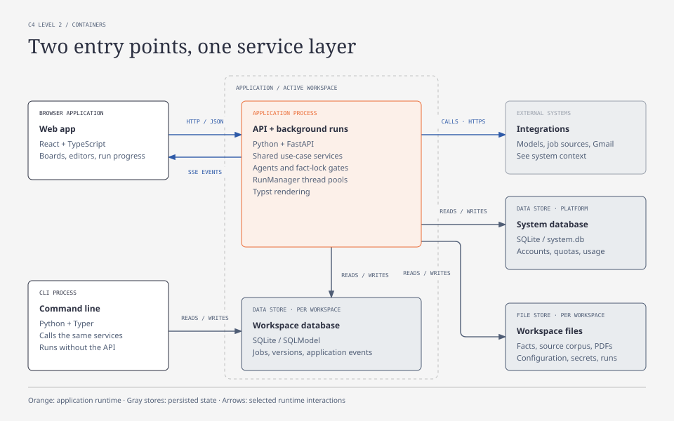
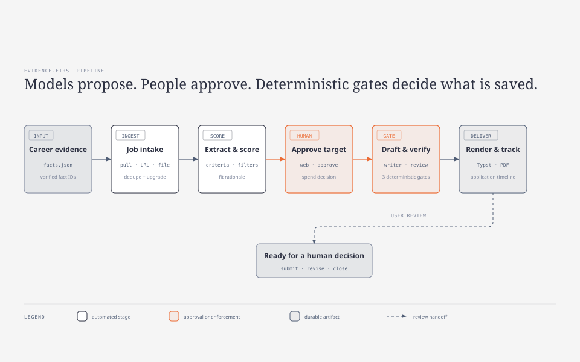

# Résumé Tailor Harness

[](https://github.com/awbjcj/resume-tailor-harness/actions/workflows/ci-main.yml)
[](LICENSE)
[](https://www.python.org/)

[English](README.md) | [简体中文](README.zh-CN.md)

Résumé Tailor Harness 覆盖完整的求职流程。它从招聘网站连接器、LinkedIn 或手动粘贴的职位描述中收集职位；根据你的**事实锁定**经历档案进行匹配评分；定制简历，起草配套求职信；将两者渲染为 PDF；并在工作区级 SQLite 数据库中跟踪每份申请。你可以将它作为命令行工具、本地网页应用或多用户托管服务使用。

**事实锁定（fact-lock）**要求定制简历中的每条要点都能追溯到你提供的事实。智能体可以起草、重新表述和评审；确定性的控制流闸门决定哪些内容可以进入已保存的文档。[框架机制](#框架机制)一节会说明这些保护措施。

_下文截图来自一个可随时丢弃的演示工作区，其中的公司和职位均为虚构。_

## 系统架构

React 前端和 CLI 都是同一用例服务层的轻量入口。这些服务负责协调受限智能体、确定性事实锁定闸门、工作区级持久化、外部集成和 Typst 渲染。在托管模式下，同样的架构运行于已认证、租户隔离的工作区中；所有受用户输入影响的公网请求都要通过已校验的出站网关。



[打开可独立查看的系统架构图](docs/diagrams/system-architecture.html)。

---

## 框架机制

本仓库组合了六项保护措施，让开放式写作任务更可信、更易复现，也更容易控制。

### 1. 事实锁定保护每条表述

你的简历和代码仓库会被抽取为**封闭 schema** 的证据档案（`data/profile/facts.json`）：每条事实都有 id，抽取 schema 会拒绝未定义的字段，因此项目类来源无法悄悄生成工作或教育经历。

随后，每轮定制都会经过**三道确定性闸门**。它们全部在进程内运行，不调用模型：

| 闸门               | 在草稿出现以下情况时拦截本轮             |
| ------------------ | ---------------------------------------------------- |
| `provenance`       | 引用的事实 id 无法解析为真实事实             |
| `skill-naming`     | 声称了档案中未能证明的技能                 |
| `numeric-evidence` | 写入了证据无法支持的数字                   |

这三个名称是**保留名**。把评审员配置成其中任意一个都会导致启动失败，因此修改评审名单无法遮蔽闸门。闸门结果和 LLM 评审意见都会汇入同一个判定构造函数（`tailor/verdict.py::aggregate`），因此“本轮是否通过”只有一个定义。任何闸门失败都会拦截本轮，与评分高低无关。

求职信使用同一道确定性 provenance 闸门，不使用评审团。

### 2. 技能集中式定制（skill-concentrated tailoring）

任务智能体属于一个稳定的**智能体族（agent family）**，例如职位分析、简历撰写、简历评审、求职信、面试、Career Lab、内部档案或担保研究。每个智能体只使用**一个**已批准的执行程序。

这些程序是本地 `SKILL.md` 文件。根目录受限、经过 **SHA-256 校验的注册表**（`career_skills/registry.py`）会根据 `skills-lock.json` 中锁定的清单解析它们。模型不选择路径，只提供能力名称；注册表返回唯一且不可变的 `SkillRef`（名称、版本、摘要、族）。如果文件被编辑、改为符号链接或指向技能根目录之外，该能力就会被**停用**，系统不会加载被篡改的文本。解析出的引用会与它影响的每份产物和每轮对话一同保存，从而将任何输出追溯到生成它的程序字节。

### 3. 受限的只读工具循环

Source Scout、Profile Coach、担保研究和 Career Lab 在循环内只使用**只读**工具：搜索、探测和查看。确定性服务在循环结束后写入数据，并要求你批准。应用会在将工具结果显示为已验证内容之前再次检查。Scout 只*建议*来源；Coach 只*起草*笔记，由你编辑后保存；Career Lab 只生成草稿，无法申请职位、上传或发送内容，也无法更新你的档案。

### 4. 最小权限提示（least-privilege prompting）

评审员看到的上下文按权限划分：

- **闸门评审员**可以看到草稿、职位描述，以及*草稿实际引用的档案事实*。
- **建议类评审员**（文风、影响力、格式）完全看不到原始档案。
- 每份第三方职位描述都会被包在明确的“不可信内容”分隔符中，因此 JD 里的“忽略你的指令”属于数据，不是策略。
- 评审意见如果声称了错误的评审员身份，就会被拒绝。合并后的建议评审组必须准确覆盖配置名单，不能遗漏或重复评审员。

### 5. 用控制流表达成本控制

评审团是成本最高的环节，因此框架会谨慎使用它：

- 可以机械证明的闸门会在付费评审团**之前**运行，因此引用错误能在同一轮中交给修订者，避免再用一轮高成本事实检查来发现它。
- **仅**因 provenance 失败的一轮可以获得一次**免费重试**，不占用 `max_rounds` 中的质量轮次。
- 每次修订都从**评分最高且通过所有闸门的那一轮**开始，糟糕的修订不会成为下一轮的基础。
- 评分下降时，循环会提前结束，避免再执行一轮付费评审。
- 三个模型档位（`CHEAP_MODEL`、`MID_MODEL`、`PREMIUM_MODEL`）都使用**提供商前缀**。低成本抽取可以在 Gemini 上运行，写作器可以继续使用 Claude，而且未使用的提供商 SDK 不会被导入。

### 6. 持久化运行与数据保管

耗时操作以后台**运行（run）**的形式执行，并配有持久事件日志：Server-Sent Events 可以恢复，取消采用协作方式，终态结果会写入幂等历史记录，因此浏览器断开不会丢失结果。在托管模式下，每个用户都有独立工作区，包含各自的数据库、语料库、密钥和渲染产物。所有受用户输入影响的请求都会通过抗 DNS 重绑定的出站网关；网关会校验每次重定向，并锁定已验证的地址。

---

## 工作流程

职位会沿着一条漏斗流转。每个阶段都有一条推进流程的命令，其中两个节点由你做决定。两个生成文档的阶段在保存产物前，都会执行[框架机制](#1-事实锁定保护每条表述)中的确定性闸门。



[打开可独立查看的生命周期图](docs/diagrams/resume-lifecycle.html)。

| 阶段             | 命令                         | 会发生什么 |
| ---------------- | ---------------------------- | ------------ |
| **导入**         | `pull` / `scrape` / `addjob` | 原始职位写入数据库（按 URL 或 JD 文本去重）。`pull` 运行所有已启用的招聘网站连接器；`scrape` 驱动 LinkedIn；`addjob` 手动导入一个职位。 |
| **发现**         | `discover`                   | 智能体抽取结构化条件，执行硬性筛选和匹配评分，并把符合条件的职位移到 `shortlisted`。 |
| **👤 批准**      | 网页应用或 `approve`        | 这是成本闸门：你只批准值得花费模型成本进行定制的职位。 |
| **定制**         | `tailor`                     | 写作智能体起草事实锁定的简历；评审团提出意见，修订者循环修改直到通过。 |
| **求职信**       | `cover-letter`               | 为每个职位起草事实锁定的求职信，经确定性来源检查后渲染为 PDF。 |
| **渲染**         | `render`                     | 将选定的简历版本生成到 `output/` 中的 PDF。 |
| **👤 跟踪**      | 网页应用 / `sync-status`       | 记录带日期的申请事件、结果、复盘和 offer 详情；导出日历/CSV，或让 `sync-status` 读取 Gmail 并**建议**由你应用的状态变更。 |

### 界面预览

看板中的每个职位都会打开到同一个详情视图，其中包含匹配分数、所需技能，以及每个阶段对应的页签：


**导入。** `pull` 会运行你已启用的连接器；顶部工具栏的 `+ Add URL` 和 `Import file…` 用于手动导入一个职位。在 **Settings → Sources**（`/settings/sources`）中管理招聘看板：


**发现。** 抽取和筛选结果会进入 **Triage** 页面（`/triage`）。在任何职位进入候选清单前，先清理原始和已拒绝的待处理项：


**👤 批准。** **Shortlist** 页面（`/shortlist`）是成本闸门。查看已评分职位，只批准值得花费成本定制的职位：


**定制。** 打开一个职位 → **Resumes** 页签，查看每轮评分、事实检查状态，以及 PDF 渲染和修订操作：


**求职信。** 打开一个职位 → **Cover letters** 页签，查看事实锁定的草稿、来源检查和 **Generate another** 选项：


**渲染。** 已渲染的 PDF 会显示在 **Pipeline** 看板（`/pipeline`）中的独立阶段，与其他正在进行的阶段并列：


**👤 跟踪。** 打开一个职位 → **Tracking** 页签，设置申请状态并记录完整时间线：投递、初筛和面试轮次、结果、复盘、offer 详情与自定义事件。带日期的事件可以下载为日历文件，`sync-status` 也可以根据 Gmail 邮件建议状态变更：


---

## 前置要求

请选择一种安装方式：

- 容器运行需要 Docker Engine 和 Compose 插件。Docker Desktop 已包含两者。
- 原生开发需要 **[uv](https://docs.astral.sh/uv/)** 和带 npm 的 **Node.js 22+**。项目由 `uv` 管理 Python 3.13。

AI 功能需要一个 LLM 提供商密钥。发现、定制和求职信步骤默认使用 **Claude**，因此只有 Anthropic 密钥也可以开始。系统也支持 OpenAI、Google Gemini 和 DeepSeek。没有密钥时仍可启动应用，然后在网页界面中完成配置。详见 [LLM 提供商](#env密钥和模型)。

可选集成：

- **GitHub token** 可以从代码仓库补充你的档案。
- **LinkedIn 专用账号**只在使用 `scrape` 时需要。
- 招聘网站连接器密钥可以为 [Adzuna API](https://developer.adzuna.com/) 等来源启用 `pull`。Greenhouse 和 RemoteOK 无需密钥。
- Gmail OAuth 凭据可启用 `sync-status`、定时同步、提醒和邮件草稿。详见 [Gmail 设置](#gmail-设置用于-sync-status同步提醒和邮件草稿)。

---

## 使用 Docker 运行

Docker 会将前端和 API 构建到同一个镜像中，将应用数据保存在具名卷里，并且只在本机的回环接口上发布应用。

### 初次配置

复制安全模板，然后在需要 AI 功能时设置 LLM 提供商密钥（例如 `ANTHROPIC_API_KEY`）。没有密钥也可以启动应用，再从界面完成配置。

```powershell
Copy-Item .env.example .env
notepad .env
```

如果端口 `8000` 已被占用，可以设置可选的 `RESUME_TAILOR_HARNESS_PORT`。`.env` 文件不会进入构建后的镜像。不要为了使用随附服务而在 `.env` 中启用 H-1B 变量；可选 Compose 栈会在运行时提供它的私有容器 URL。

### 启动应用

```bash
docker compose up --build
```

打开 <http://localhost:8000>。按 `Ctrl+C` 停止，之后使用 `docker compose up` 重新启动。`docker compose down` 会删除容器和网络，但保留具名数据卷。只有在你明确想要删除本地应用数据和 H-1B 缓存数据时，才使用 `docker compose down --volumes`。镜像中已禁用需要浏览器的连接器；需要 LinkedIn 或其他浏览器驱动来源时，请使用原生安装。

### 启动可选 H-1B 服务

本仓库将配套服务锁定为子模块，并使用冻结的依赖锁进行构建，因此组合栈使用的是已知源码版本。克隆时使用 `--recurse-submodules`，或在现有克隆中初始化一次：

```bash
git submodule update --init --recursive
docker compose -f compose.yaml -f compose.h1b.yaml --profile h1b up --build
```

这会同时启动应用和 H-1B MCP 服务。MCP 端点只对 Docker 网络开放；只有应用仍可从 <http://localhost:8000> 访问。两个数据库都使用具名卷，正常停止或重启不会丢失数据。历史 H-1B 数据只是辅助证据，不能证明公司当前的担保政策。

### Windows 快速启动

安装并启动 [Docker Desktop for Windows](https://www.docker.com/products/docker-desktop/)（默认 WSL 2 后端适合大多数用户），然后在 PowerShell 中验证：

```powershell
docker version
docker compose version
```

只有计划使用 `-WithH1B` 时才需要安装 Git for Windows，因为该模式会在首次使用时初始化锁定的服务子模块。

随附的 PowerShell 启动器会创建缺失的 `.env`、检查 Docker Desktop、在需要时初始化可选子模块，并在停止后保留数据：

```powershell
.\scripts\windows\Start-ResumeTailor.cmd -Detach
.\scripts\windows\Start-ResumeTailor.cmd -WithH1B -Detach
.\scripts\windows\Start-ResumeTailor.cmd -WithH1B -Status
.\scripts\windows\Start-ResumeTailor.cmd -WithH1B -Stop
```

`-WithH1B` 是可选项；省略它即使用体积更小的默认镜像。需要其他本地端口时，可以在任一启动命令中添加 `-Port 8080`。`.cmd` 启动器只会对子 PowerShell 进程应用执行策略绕过；你也可以在已配置的 shell 中直接调用 `.ps1` 文件。

如果想在不使用 Compose 的情况下构建并运行镜像：

```bash
docker build -t resume-tailor-harness .
docker run --name resume-tailor-harness --init --restart unless-stopped \
  -e APP_MODE=local \
  -p 127.0.0.1:8000:8000 \
  -v resume-tailor-harness-data:/app/data \
  resume-tailor-harness
```

PowerShell 可以使用反引号代替反斜杠执行同一命令，也可以将其写成一行。如果想在容器启动时注入提供商密钥，请先创建 `.env`，再在命令中添加 `--env-file .env`；也可以从网页界面保存密钥。

镜像默认使用无需认证的本地模式。面向公网的多用户部署应设置 `APP_MODE=hosted`，并按照[托管式多用户服务器](#托管式多用户服务器)操作；托管模式需要凭据和规范的 HTTPS URL。

## 原生安装（Windows、macOS 和 Linux）

引导命令会安装锁定的 Python 和前端依赖，并创建缺失的本地配置文件，不覆盖你已做的修改：

```bash
uv run --no-project scripts/bootstrap.py
uv run resume-tailor-harness setup                 # optional guided configuration
uv run python scripts/dev.py              # API + frontend; Ctrl+C stops both
```

打开 <http://localhost:5173>。这些命令可以在 PowerShell、命令提示符和 POSIX shell 中执行。如果你使用 `make`，`make setup` 和 `make dev` 是简写命令。只有需要 LinkedIn 等浏览器驱动的职位来源时，才向引导命令传入 `--browser`。

`resume-tailor-harness setup` 会引导你配置密钥、搜索条件和连接器，并写入 `.env` 和 `config/*.yaml`。你也可以直接编辑由仓库内示例生成的文件。

其余内容（SQLite 数据库、`output/` 和 `data/` 目录）会在首次运行时自动创建。

---

## 求职工具

这些工具共用同一份事实锁定档案、已验证的技能注册表、只读工具循环和持久运行历史。它们用来处理求职过程中反复出现的工作：

| 工具                     | 如何帮助你 |
| ------------------------ | ---------- |
| **Profile Coach**        | 补充你尚未写下的经历证据。它每次只问一个问题，而且只根据你的回答起草。 |
| **Mock Interviews**      | 让你针对具体的定制职位演练，并提供带评分的复盘。 |
| **Career Lab**           | 支持谈薪准备、转行和作品集写作。每轮使用一个已验证技能，所有输出都保留为草稿。 |
| **Match-gap**            | 按需求职位数量排列目标职位需要、但你的档案尚未体现的技能。 |
| **担保证据**         | 把历史申报记录作为研究信号，不承诺当前是否提供担保。 |
| **公司情报**         | 在你发起请求时创建带引用的雇主简报。 |
| **申请时间线**       | 将轮次、结果和截止日期放在同一数据集中，可导出为 CSV 或日历。 |
| **Gmail 同步**          | 读取收件箱，并建议由你批准的状态更新。 |
| **Analytics**            | 显示哪些来源和匹配分档能够进入更后的阶段。 |

### 职业辅导：Profile Coach、Mock Interviews 和 Career Lab

侧边栏中有三个辅导工具，分别对应求职过程中的不同阶段。

**Profile Coach**（`/coach`）会查看当前的事实锁定档案，每次针对你可能遗漏的结果、规模或项目证据提出一个具体问题，并且只起草有你的实际回答支持的表述：


**Mock Interviews**（`/interview`）针对具体的定制职位进行集中演练，然后把对话转换为一份可执行的评分复盘：


**Career Lab**（`/career-lab`）是一个草稿工作区，也可以通过 `career-lab` CLI 命令和 `/api/career-lab` REST 资源访问。它将每轮对话路由到一个已验证的本地职业技能，每个工作区保留一个活跃会话，使用可恢复的流式运行，并支持结束、归档、取消归档和删除操作。所有输出都是草稿，无法申请职位、上传或发送内容，也无法更新档案。


```bash
uv run resume-tailor-harness career-lab "Prepare negotiation points" \
  --skill salary-negotiation-prep --offer-application-id 7
```

H-1B 补充信息是可选的历史证据，只用于搜索配置要求研究担保、但职位信号未给出结论的职位。在 `.env.example` 中设置 `H1B_MCP_ENABLED=true`，然后配置本地 `stdio` 命令或无需凭据的 Streamable HTTP URL，两者不要同时配置。应用只公开以下只读 MCP 工具：`h1b_get_company_stats`、`h1b_search_h1b_jobs` 和 `h1b_get_available_data`。历史申报记录只是辅助证据，无法确认当前的担保情况或雇主政策，也不会改变职位信号或硬性拒绝职位。在职位详情视图的 **Sponsorship** 页签中按职位查看：


在本地开发环境中，`make dev` 只启动 API 和 Vite 前端，因此新克隆中没有 H-1B 服务进程。执行 `git submodule update --init --recursive` 后，`make full-stack` 也会启动可选的随附 `h1b-job-search-mcp` 服务器。该启动器使用 `http://127.0.0.1:8001/mcp` 建立 API 的 Streamable HTTP 连接，因此不需要手动设置 MCP 命令或 URL。启动后运行 `make stack-health`，检查两个 HTTP 健康端点以及 MCP 握手/工具允许列表。

对应的 Docker 方式请使用[使用 Docker 运行](#使用-docker-运行)中的可选 `h1b` profile。不要将 `localhost` 用作该 profile 的 MCP URL：在容器内，它指向的是应用容器，而不是配套服务。

### 申请工作区与公司研究

**Applications** 页面（`/applications`）从同一份时间线数据集中显示活跃申请。你可以搜索和排序表格、对比重复的技术面试轮次，并导出便于阅读的宽表或无损的事件级 CSV。**Analytics**（`/analytics`）使用同一数据集生成阶段流向、周期时长、活跃流水线和 offer 对比。你还可以将即将发生的事件一次下载为 `.ics` 日历。

每个职位的 **Research** 页签会分开雇主证据和担保证据。**Company intelligence** 会在你主动刷新时创建一份带引用的简报，涵盖战略、近期动向、工程文化、挑战和竞争定位。只有研究输出中确实出现的引用才能通过校验；过期证据会明确标记；标准化公司名相同的职位会共用已保存的档案。

你可以将 Triage、Shortlist 和 Pipeline 的筛选条件保存为工作区命名视图。通知菜单会保留后台运行的最终成功、失败和取消结果。Dashboard 会汇总练习分数趋势、未解决的来源故障和操作队列。

---

## 部署与集成

### 托管式多用户服务器

`resume-tailor-harness serve` 默认是无需认证的本地应用：它绑定回环地址，复用现有管理员工作区（或在首次启动时创建 `local` 工作区），且不需要账户凭据。如果要公开服务或启用多用户，请选择托管模式，并在首次启动前初始化第一个管理员：

```bash
uv run resume-tailor-harness serve --mode hosted --host 0.0.0.0
```

```env
AUTH_USERNAME=owner
AUTH_PASSWORD_HASH=<output of `uv run resume-tailor-harness hash-password`>
SESSION_SECRET=<long random value>
```

登录后，在 **Admin** 页面或通过 `resume-tailor-harness admin invite` 创建一次性邀请。成员在 `/register` 注册；每人都会获得独立的数据库、档案语料库、配置、密钥、输出和运行历史。管理员管理定期美元成本额度、持久积分、按生效日期管理的 LLM 费率、活跃职位上限和并发运行上限。[成本配额改造](docs/cost-quotas.md)开始执行后，token 用量仍用于共享密钥/BYOK 分析，但不再控制配额。成员可以在网页界面中管理自己的密钥、token、密码和工作区导出。远程成员的工作流以网页为主；本地领域 CLI 可以用 `--user USERNAME` 选择现有工作区。

`REGISTRATION_MODE`（默认为 `invite`，也可设为 `closed`/`open`）控制注册是否需要邀请。管理员、免费成员和订阅用户都可以使用平台的共享 LLM 密钥。请将这些密钥配置为 Railway 环境变量；系统会优先于工作区密钥选择它们。当适用的账户或平台额度用尽后，如果用户已配置对应提供商的密钥，调用会自动改用该密钥。`GLOBAL_DAILY_SIGNUP_LIMIT` 和 `GLOBAL_WEEKLY_TOKEN_BUDGET` 分别限制全平台的验证邮件总量和共享密钥总支出，与账户数量无关。完整变量清单和建议的生产环境配置见 [Railway 部署](docs/deploy-railway.md)。

### Gmail 设置（用于 `sync-status`、同步、提醒和邮件草稿）

Gmail 为 CLI 的 `sync-status` 提供支持；在 API/网页应用中，它还支持定时后台收件箱同步、长时间未更新申请的跟进提醒和邮件草稿撰写。它只会**读取**邮件（readonly scope）和**创建草稿**（compose scope），绝不会发送邮件。`.env` 中不保存密码；系统通过 Google OAuth 客户端认证，客户端类型取决于你的运行方式。

**CLI，单机：**将 OAuth **Desktop app** 客户端保存为文件：

1. 在 [Google Cloud 控制台](https://console.cloud.google.com/) 中创建或复用项目，启用 **Gmail API**，并创建 _Desktop app_ 类型的 **OAuth client ID**。
2. 下载客户端 secret JSON，并将其保存为 `config/gmail_credentials.json`。
3. 首次运行 `sync-status` 时，浏览器会打开一次授权页面；授予的 token 缓存在 `data/gmail_token.json`（Git 已忽略）中，以后会重复使用。

**网页应用 / API 服务器**（Railway 部署使用）：使用通过环境变量配置的 OAuth **Web application** 客户端，而不是文件：

1. 创建 _Web application_ 类型的 OAuth client ID（可以使用上述同一 Cloud 项目）。添加授权重定向 URI `<your-domain>/api/gmail/callback`，例如本地 `resume-tailor-harness serve` 使用 `http://localhost:8000/api/gmail/callback`，云部署则使用 Railway 域名（参见 [Railway 部署](docs/deploy-railway.md#gmail-oauth-optional)）。
2. 在 `.env` 中（或 Railway 的平台环境变量中）设置 `GOOGLE_OAUTH_CLIENT_ID` 和 `GOOGLE_OAUTH_CLIENT_SECRET`。这是每个工作区默认通过的**平台客户端**；已登录用户也可以在 Settings → Keys 中粘贴自己的 client id/secret，仅对其工作区覆盖平台客户端。
3. 登录网页应用，打开 **Settings → Keys**，然后在 Gmail 卡片上点击 **Connect Gmail** 启动授权流程。获得的 token 按工作区分别保存，不会在用户之间共享。

无论使用哪种方式，如果 OAuth 同意屏幕仍处于 **Testing** 发布状态（默认状态），都需要在 Cloud 控制台中把每个将要连接的 Gmail 地址添加为**测试用户**。Google 将测试应用限制为 100 个用户，不在列表中的人无法登录。

如果你更喜欢在网页应用中手动跟踪状态，可以跳过此集成。其余功能不依赖 Gmail。

下文所有命令都写为 `uv run resume-tailor-harness …`。如果不想每次加这个前缀，请先激活虚拟环境（Linux/macOS 使用 `source .venv/bin/activate`，Windows 使用 `.venv\Scripts\Activate.ps1`），然后省略 `uv run`。

---

## 快速开始

```bash
# 1. Build your fact-lock profile from your resume (+ optional GitHub)
uv run resume-tailor-harness profile build

# 2. Get some jobs into the pipeline (pick one)
uv run resume-tailor-harness pull --limit 10            # job-board connectors, or…
uv run resume-tailor-harness scrape --limit 10          # LinkedIn, or…
uv run resume-tailor-harness addjob --company "Acme" --title "Backend Engineer" --jd-file jd.txt

# 3. Score them against your profile and your search criteria
uv run resume-tailor-harness discover
uv run resume-tailor-harness match-gap                 # optional: see missing high-demand skills

# 4. Review the shortlist and approve the keepers in the web app
make dev                                # http://localhost:5173

# 5. Tailor every approved job, and draft matching cover letters
uv run resume-tailor-harness tailor --approved
uv run resume-tailor-harness cover-letter --approved

# 6. Render a specific resume version to PDF (id shown in the web app)
uv run resume-tailor-harness render 12

# 7. Track submissions back in the web app
make dev                                # http://localhost:5173

# 8. Later, let Gmail propose status updates (review first, then apply)
uv run resume-tailor-harness sync-status               # lists proposals only
uv run resume-tailor-harness sync-status --apply        # applies them
```

---

## 命令参考

运行 `uv run resume-tailor-harness --help` 查看完整命令列表。查看某一命令时，运行 `… <command> --help`。每条命令都接受 `--db-url` 以使用其他数据库，这对测试很有用。

### `profile build`：创建事实锁定档案

读取你的简历（如果已配置，也读取 GitHub），并写入 `data/profile/facts.json`。这个文件是之后所有步骤可以使用的**事实基准**。

```bash
uv run resume-tailor-harness profile build [--sources config/profile_sources.yaml] [--out data/profile/facts.json] [--refresh]
```

`--refresh` 会重建文件，并**丢弃所有手动编辑**。不使用它时，命令会拒绝覆盖现有 `facts.json`。

### `addjob`：手动添加一个职位

职位描述从 `--jd-file` 读取；省略该参数时从标准输入读取。

```bash
uv run resume-tailor-harness addjob --company "Acme" --title "Backend Engineer" --url "https://…" --jd-file jd.txt
```

系统会检测并跳过重复职位（URL 相同或 JD 文本完全相同）。

### `scrape`：从 LinkedIn 获取职位

使用 `search.yaml` 搜索 LinkedIn，并将匹配的职位作为原始职位导入。**首次运行：**系统会打开真实浏览器窗口。请手动登录 LinkedIn 专用账号一次。会话保存在 `.linkedin_profile/` 中，以后会重复使用。

```bash
uv run resume-tailor-harness scrape [--search config/search.yaml] [--limit 25]
```

`--limit` 限制本次运行处理的职位数量，请保持适度。

### `pull`：从招聘网站连接器获取职位

运行 `connectors.yaml` 中已启用的每个连接器，将结果去重后写入 `raw` 职位，并输出每个来源的数量。较高优先级的规范来源重新找到数据库中来自聚合器的职位时，系统会就地**升级**已存储的 URL 和 JD 文本。汇总会显示 `+N added, N upgraded`。Adzuna 等密钥来自 `.env`，需要访问的看板/来源由 `connectors.yaml` 决定。

| 连接器       | 所需配置 |
| ------------ | -------- |
| `greenhouse` | `connectors.yaml` 中的看板 token |
| `lever`      | `connectors.yaml` 中的看板 slug |
| `adzuna`     | `.env` 中的 `ADZUNA_APP_ID` + `ADZUNA_APP_KEY` |
| `remoteok`   | 无；它使用公开 API |
| `linkedin`   | `.env` 中的专用账号凭据（与 `scrape` 相同） |
| `companies`  | `connectors.yaml` 中的职业页面 URL。可检测 Greenhouse、Lever、Ashby、Workday、Tesla 和 Google |

```bash
uv run resume-tailor-harness pull [--connectors config/connectors.yaml] [--search config/search.yaml] [--limit 25]
```

`--limit` 限制每个连接器在本次运行中处理的职位数量。如果缺少 `config/connectors.yaml`，命令会先提示你从示例复制。

### `sources`：连接器运行历史

显示每个连接器上次运行的时间、添加的职位数和最近的错误（如有）。运行 `pull` 后，可以用它快速检查运行状况。

```bash
uv run resume-tailor-harness sources
```

### `discover`：抽取、筛选和评分

对数据库中的每个 `raw` 职位执行漏斗流程。它会抽取结构化条件，移除未通过硬性筛选的职位，并为其余职位给出 0 到 100 的匹配分数和理由。符合条件的职位会移到 `shortlisted`。

```bash
uv run resume-tailor-harness discover [--search config/search.yaml] [--facts data/profile/facts.json]
```

### `match-gap`：目标职位需要但档案未体现的技能

将所有通过发现流程的职位（`shortlisted` / `approved` / `tailored` / `rendered`）的 `must_have_skills` 与档案中的技能名称和别名进行比较。缺口按需要该技能的目标职位数排序。这是只读操作，不会编辑 `facts.json`。网页应用的 **Match-gap**（`/match-gap`）提供相同视图：


```bash
uv run resume-tailor-harness match-gap                 # aggregate, most-demanded first
uv run resume-tailor-harness match-gap --job-id 7      # gaps for one target job
uv run resume-tailor-harness match-gap --llm           # optional synonym pass, e.g. k8s/Kubernetes
```

### `approve`：成本闸门（网页应用的 CLI 替代方式）

将候选职位标记为 `approved`，使其可以进入定制流程。

```bash
uv run resume-tailor-harness approve 7
```

### `tailor`：起草与评审循环

定制一个职位（`--job-id`）或所有已批准职位（`--approved`）。每轮都会保存为 `ResumeVersion`。三道确定性闸门和评审团共同判定该轮结果。循环持续修订，直到草稿通过或用完 `max_rounds` 质量轮次。

**fact-check** 评审员、`provenance`、`skill-naming` 和 `numeric-evidence` 都是硬性闸门。仅 provenance 失败的一轮可免费重试，不占用质量轮次。可选的 `config/style_guide.md` 文本会附加到写作器、修订器和评审员的固定事实锁定规则之后。它决定简历如何写，不决定可以声称什么。完整控制流见[框架机制](#框架机制)。

```bash
uv run resume-tailor-harness tailor --approved
uv run resume-tailor-harness tailor --job-id 7
```

### `cover-letter`：起草事实锁定的求职信

为一个职位（`--job-id`）或所有已批准职位（`--approved`）撰写求职信，然后渲染为 `output/` 中的 PDF。写作器只使用你的 `facts.json`。**确定性 provenance 闸门**会检查每一段是否引用了真实事实 ID，并让修订器循环处理直到草稿干净。如果最终没有通过，应用会记录 `fact_check_passed=False`，提醒你不要发送。此流程使用确定性闸门，不使用评审团。

```bash
uv run resume-tailor-harness cover-letter --approved
uv run resume-tailor-harness cover-letter --job-id 7
```

### `render`：将版本渲染为 PDF

通过 Typst 模板将已保存的简历版本（按 ID）渲染到 `output/`。每个版本的文件名唯一，因此重新渲染不会覆盖较早的 PDF。

```bash
uv run resume-tailor-harness render 12 [--config config/render.yaml]
```

### 网页应用：可视化看板

网页应用运行 FastAPI 后端和 React 前端，提供 Shortlist、Pipeline、Triage、Applications、Analytics 和 Match-gap 视图。你可以在这里批准候选职位、查看渲染产物、维护申请时间线、保存看板视图和清理过期职位。应用首页是 **Dashboard**（`/`），显示每个阶段的每日数量、练习和来源健康洞察，以及需要处理的工作链接：


**Analytics**（`/analytics`）显示哪些来源和匹配分数区间会转化为面试和 offer，同时展示阶段流向、周期时长、活跃申请时间线和薪酬对比：


```bash
make dev                                # http://localhost:5173
```

### `sync-status`：让 Gmail 建议状态更新

以只读方式扫描近期收件箱邮件，按公司将邮件与已跟踪申请匹配，再使用确定性规则和可选的低成本 LLM 回退进行分类（拒绝 / 面试 / 测评 / offer），最后**建议**只向前的状态变更。只有使用 `--apply` 再次运行后才会实际更改，状态不会被静默修改。它需要 [Gmail 设置](#gmail-设置用于-sync-status同步提醒和邮件草稿)中的 CLI/Desktop app 配置。

```bash
uv run resume-tailor-harness sync-status                 # list proposals only
uv run resume-tailor-harness sync-status --apply         # apply them
uv run resume-tailor-harness sync-status --max-results 100
```

---

## API 服务器

流水线也会通过 HTTP 提供给 React 前端和其他 API 客户端：

```bash
uv run resume-tailor-harness serve                       # http://127.0.0.1:8000
uv run resume-tailor-harness serve --mode hosted --host 0.0.0.0 --port 8080
```

本地模式跳过账户认证，始终激活默认工作区，并拒绝非回环绑定。托管模式会启用登录、bearer/PAT 检查、租户选择、注册和隔离的用户工作区。容器默认使用本地模式；设置 `APP_MODE=hosted` 或提供 `APP_BASE_URL` 等仅托管设置后，它会切换到托管模式。

- 交互式文档位于 `/docs`，OpenAPI schema 位于 `/openapi.json`。
- 前端使用的已提交契约位于 `contracts/`（`openapi.json` + 生成的 `ts/api.ts`）；每次 schema 变更后，运行 `bash scripts/gen_ts_client.sh` 重新生成。
- 耗时操作会返回一个**运行**，可以通过 `GET /api/runs/{id}/events`（Server-Sent Events）监视，或轮询 `GET /api/runs/{id}`。终态结果也会记录在持久的 `/api/run-completions` 历史中，因此浏览器断开不会丢失结果。
- 申请事件位于 `/api/jobs/{job_id}/events`；跨职位投影是 `/api/applications`，提供宽表/长表 CSV 和按用途限制的 ICS 下载。已保存看板视图使用 `/api/board-views`，显式公司研究使用 `/api/jobs/{job_id}/company-intelligence/refreshes`。
- 在托管模式下，为 API 访问配置账户凭据/PAT，并为独立的前端开发服务器设置 `CORS_ORIGINS`（逗号分隔）。本地模式会有意忽略账户和 API 认证设置。

Gmail 同步（`POST /api/gmail/sync`）、连接/状态/断开（`/api/gmail/connect|status|token`）和邮件草稿都通过 HTTP 开放。尚未通过 HTTP 开放的功能有 `profile build` 和 LinkedIn `scrape`。

---

## 配置

### `.env`：密钥和模型

将 `.env.example` 复制为 `.env`。应用会自动加载它。示例包含所有由环境变量提供的应用设置，并带有安全的本地默认值。可接受值、范围、托管/Docker 覆盖和集成要求请查看[完整环境配置参考](docs/configuration.md)。

#### 选择 LLM 提供商

每次 LLM 调用使用三个模型档位之一：`CHEAP_MODEL`、`MID_MODEL` 和 `PREMIUM_MODEL`。它们默认使用 Claude Haiku、Sonnet 和 Opus。模型 ID 可以带提供商前缀；不带前缀的 ID 使用 Anthropic，`openai:`、`gemini:` 或 `deepseek:` 前缀则将该档位路由到其他提供商。每个档位使用对应提供商的密钥，因此可以自由混用：

```bash
CHEAP_MODEL=gemini:gemini-3.5-flash-lite # cheap extract/fit/relevance on Gemini
MID_MODEL=deepseek:deepseek-v4-flash    # reviewers / cover-letter reviser on DeepSeek
PREMIUM_MODEL=claude-opus-5             # bare id → Anthropic for the tailor writer
```

只需设置实际使用的提供商密钥。提供商 SDK 会延迟加载，因此仅使用 Claude 的运行不会触及 OpenAI 或 Gemini 库。

> **Gmail** 只在 CLI 中通过 `config/gmail_credentials.json` 认证；API/网页应用则使用上述 `GOOGLE_OAUTH_CLIENT_ID`/`_SECRET` 环境变量。详见 [Gmail 设置](#gmail-设置用于-sync-status同步提醒和邮件草稿)。

### `config/*.yaml`

| 文件                   | 控制内容 |
| ---------------------- | -------- |
| `profile_sources.yaml` | 你的简历路径和 GitHub 用户名。 |
| `search.yaml`          | 关键词、职位、地点和**硬性筛选**（薪资、工作年限、远程政策、担保）。 |
| `connectors.yaml`      | `pull` 运行的招聘网站连接器及其参数：Greenhouse 看板 token、Lever slug、Adzuna 国家/地区、RemoteOK、LinkedIn 开关，以及用于直接 ATS 或门户 URL 的 `companies.urls`。它可检测 Greenhouse、Lever、Ashby、Workday、Tesla 和 Google；密钥保留在 `.env` 中。 |
| `review.yaml`          | 评审名单、权重/模型档位、`max_rounds`、`score_threshold`、可选的 `length_budget` 单页指导和 `style_guide_path`。 |
| `render.yaml`          | Typst `template_path` 和 PDF `output_dir`。 |
| `style_guide.md`       | 附加到简历定制循环的可选文风说明。它决定如何写，不决定可以声称什么；文件缺失或为空时不作改变。 |

每个 `*.yaml.example` 都带有注释。复制后再编辑。

求职信和简历模板位于 `templates/`（`cover_letter.typ`、`resume.typ`），可以直接编辑。`config/gmail_credentials.json`（仅供 CLI 的 `sync-status` 使用）是唯一没有示例的配置文件；它是你从 Google Cloud 下载的 Desktop app OAuth 客户端密钥（参见 [Gmail 设置](#gmail-设置用于-sync-status同步提醒和邮件草稿)）。API/网页应用改用 `.env` 中的 `GOOGLE_OAUTH_CLIENT_ID`/`_SECRET`。

### 来源优先级

多个连接器发现同一职位时，**规范来源**总是优先于**聚合来源**副本：

| 层级                            | 来源 |
| ------------------------------- | ---- |
| **规范来源**（优先级较高） | `greenhouse`、`lever`、`ashby`、`workday`、`tesla`、`google`、`companies`、`url`（手动粘贴） |
| **回退来源**（优先级较低） | `adzuna`、`remoteok`、`linkedin` |

同一层级中采用**先发现者优先**，避免相同层级的重复拉取导致内容来回变化。

**升级而不是丢弃。** 如果规范来源重新找到此前从回退来源导入的职位，已存储的职位字段（`url`、`jd_text`、`source`、`title`、`location`）会就地升级，并保留相同的 `Job` id。定制简历、求职信和申请状态都不会改变。

职位状态一旦越过 `raw`，系统只更新规范的申请 `url`；JD 文本会被冻结，避免已按该文本定制的简历在不知情的情况下更换基础。

---

## 文件位置

| 路径                                                  | 内容 |
| ----------------------------------------------------- | ---- |
| `data/resume_tailor_harness.db`                       | 所有职位、简历版本、求职信和申请（SQLite）。 |
| `data/profile/facts.json`                             | 你的事实锁定档案。 |
| `data/connector_runs.json`                            | `sources` 读取的逐连接器运行历史。 |
| `data/gmail_token.json`                               | CLI/本地模式 `sync-status` 的 Gmail OAuth token 缓存（Git 已忽略）。API/网页应用改为把每位用户的 token 存入各自工作区。 |
| `output/`                                             | 已渲染的简历和求职信 PDF（求职信带 `cl<id>` 后缀）。 |
| `.linkedin_profile/`                                  | LinkedIn 浏览器会话缓存（Git 已忽略）。 |
| `config/gmail_credentials.json`                       | 仅供 CLI 使用的 Gmail OAuth **Desktop app** 客户端密钥（Git 已忽略，由你提供）。API/网页应用改用 `GOOGLE_OAUTH_CLIENT_ID`/`_SECRET`。 |
| `templates/resume.typ` / `templates/cover_letter.typ` | 渲染器使用的 Typst 模板。 |

`data/`、`output/`、`.env`、`.linkedin_profile/` 和 `config/gmail_credentials.json` 都已被 Git 忽略。

---

## 负责任地使用抓取功能

`scrape` 只适合使用**专用账号**进行**个人低频**抓取。它会驱动已登录的真实浏览器，主动控制请求节奏，并限制每次运行的抓取量。请把 `--limit` 保持在较小范围，不要使用你在意的账号。如果不想抓取，随时可以改用手动 `addjob`。

`companies` 连接器的 Workday 后端会为每个通过初筛的职位发送一次详情请求。请在 `search.yaml` 中设置严格的相关性筛选条件，让标题闸门在详情请求开始前缩小列表。

---

## 开发

```bash
uv run pytest              # run the full test suite
uv run pytest -k scraper   # run a subset
ruff check                 # lint
```

测试是纯离线的。智能体和浏览器都由替身实现，因此测试套件不需要 API 密钥或网络。连接器后端使用从真实响应中保存的固定 JSON 数据进行测试。

v1.5 中的定制循环仍为同步执行。当前版本通过精简提示来降低成本，因此并行评审团和职位级并发留待以后实现。

## 参与贡献

欢迎贡献。请参阅[贡献指南](.github/CONTRIBUTING.md)了解本地设置和改动必须通过的检查（`make verify`）。请从 `dev` 创建分支，并向 `dev` 提交 PR。

## 安全

发现漏洞后，请根据[安全策略](.github/SECURITY.md)私下报告，不要创建公开 issue。

`docs/` 还包含对公开多用户部署的自查文档：[`resume-tailor-harness-threat-model.md`](docs/resume-tailor-harness-threat-model.md)（信任边界、攻击者模型和按优先级排列的威胁表）与 [`security_best_practices_report.md`](docs/security_best_practices_report.md)（包含严重级别、证据和修复方案的问题清单）。已经交付的架构应对措施见 [ADR-0008](docs/adr/0008-egress-gateway-tenant-storage-canonical-origin.md)，其中包括 SSRF 安全的出站网关、租户隔离的产物下载、仅由配置决定的 OAuth/cookie 来源，以及仍未关闭的 P0/P1 项。

## 许可证

[MIT](LICENSE) © awbjcj
